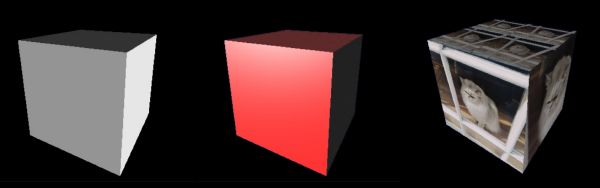

# DIRT: a fast Differentiable Renderer for TensorFlow

DIRT is a library for TensorFlow, that provides operations for rendering 3D meshes.
It supports computing derivatives through geometry, lighting, and other parameters.
DIRT is very fast: it uses OpenGL for rasterisation, running on the GPU, which allows
lightweight interoperation with CUDA.

The following images illustrate the capabilities of DIRT; see
[`samples`](https://github.com/pmh47/dirt/tree/master/samples) for source
code. The first uses simple monochromatic diffuse lighting calculated per-vertex and
interpolated with Gouraud shading; the others use per-pixel (deferred) lighting and
texture calculations.

In all cases, we can calculate gradients with respect to all inputs, including the geometry
(vertex locations and normals), lighting parameters (e.g. colour and direction), and texture
(the vertex UVs and the pixel values in the texture itself).




## Citation

If you use DIRT in your research, please cite: [*Learning Single-Image 3D Reconstruction by Generative Modelling of Shape, Pose and Shading*](https://doi.org/10.1007/s11263-019-01219-8) (P. Henderson and V. Ferrari, IJCV 2019).

The appropriate bibtex entry is:
```
@article{henderson19ijcv,
  title={Learning Single-Image {3D} Reconstruction by Generative Modelling of Shape, Pose and Shading},
  author={Paul Henderson and Vittorio Ferrari},
  journal={International Journal of Computer Vision},
  year={2019},
  doi={10.1007/s11263-019-01219-8},
  url={https://doi.org/10.1007/s11263-019-01219-8}
}
```

There is a brief description of how DIRT calculates gradients in Section 3.4 of my [PhD thesis](http://calvin.inf.ed.ac.uk/wp-content/uploads/Publications/theses/Henderson2019.pdf), for the case of per-face Lambertian shading without textures.

## Why is DIRT useful?

Drawing 3D (or 2D) shapes *differentiably* is challenging in TensorFlow. For example, you could create a tensor containing a white square on a black background using the following:
```python
import tensorflow as tf

canvas_width, canvas_height = 128, 128
centre_x, centre_y = 32, 64
square_size = 16

xs, ys = tf.meshgrid(tf.range(canvas_width), tf.range(canvas_height))

x_in_range = tf.less_equal(tf.abs(xs - centre_x), square_size / 2)
y_in_range = tf.less_equal(tf.abs(ys - centre_y), square_size / 2)
pixels = tf.cast(tf.logical_and(x_in_range, y_in_range), tf.float32)
```
However, if you calculate gradients of the pixels with respect to `centre_x` and `centre_y`, they will always be zero -- whereas for most use-cases, they should be non-zero at the boundary of the shape.

DIRT provides a single TensorFlow operation, `rasterise`, that renders shapes differentiably. Moreover, it includes helper code that supports 3D projection, lighting, etc.
This allows full 2D or 3D scenes to be assembled directly in TensorFlow, with gradients flowing through the geometry, lighting and surface parameters.

Using DIRT, the above example becomes:
```python
import tensorflow as tf
import dirt

canvas_width, canvas_height = 128, 128
centre_x, centre_y = 32, 64
square_size = 16

# Build square in screen space
square_vertices = tf.constant([[0, 0], [0, 1], [1, 1], [1, 0]], dtype=tf.float32) * square_size - square_size / 2.
square_vertices += [centre_x, centre_y]

# Transform to homogeneous coordinates in clip space
square_vertices = square_vertices * 2. / [canvas_width, canvas_height] - 1.
square_vertices = tf.concat([square_vertices, tf.zeros([4, 1]), tf.ones([4, 1])], axis=1)

pixels = dirt.rasterise(
    vertices=square_vertices,
    faces=[[0, 1, 2], [0, 2, 3]],
    vertex_colors=tf.ones([4, 1]),
    background=tf.zeros([canvas_height, canvas_width, 1]),
    height=canvas_height, width=canvas_width, channels=1
)[:, :, 0]
```


## Requirements

- an Nvidia GPU; the earliest drivers we have tested with are v367
- Linux; we have only tested on Ubuntu, but other distributions should work
- a GPU-enabled install of TensorFlow, version 1.6 or later
- python 2.7.9 / 3.5 or newer
- cmake 3.8 or newer
- gcc 4.9 or newer


## Installation

**Before** installing, you should activate a virtualenv with `tensorflow-gpu` installed (or ensure your system python has that package), as DIRT will use this to search for appropriate TensorFlow headers during installation.

Simply clone this repository, then install with pip:
```
git clone https://github.com/pmh47/dirt.git
cd dirt
pip install .
```

If you plan to modify the DIRT code, you may prefer to install in development mode:
```
cd dirt
mkdir build ; cd build
cmake ../csrc
make
cd ..
pip install -e .
```

To sanity-check your build, run `python tests/square_test.py`, which should produce the output `successful: all pixels agree`.


### Troubleshooting

- If the build cannot find `GL/gl.h` and `GL/glext.h`, you can get suitable versions of these by running the following from the `dirt` directory:
    ```
    mkdir external/GL ; cd external/GL
    wget https://raw.githubusercontent.com/mesa3d/mesa/master/include/GL/gl.h
    wget https://raw.githubusercontent.com/mesa3d/mesa/master/include/GL/glext.h
    cd ../..
    export INCLUDE=$PWD/external:$INCLUDE
    ```

- If the build cannot find `X11/Xlib.h`, install the system package `libx11-dev` or `libX11-devel`

- You should ensure that libGL and libEGL are in a location on `LD_LIBRARY_PATH`, and that these are the versions shipped with your Nvidia driver. In particular, if you have installed Mesa or Hybris, their libGL or libEGL may be used (or may even have overwritten the Nvidia versions), and these will not work with DIRT

- If you use a version of Ubuntu older than 18.04, and you use the Ubuntu-packaged Nvidia driver (i.e. installed with apt not Nvidia's runfile), then the correct GL libraries may not be found at runtime. Use `export LD_LIBRARY_PATH=/usr/lib/nvidia-XXX` (replacing XXX with your driver version). If that is not sufficient then also use `export LD_PRELOAD=/usr/lib/nvidia-XXX/libEGL.so:/usr/lib/nvidia-XXX/libOpenGL.so` to ensure that the Nvidia version of libEGL is used. If cmake fails to find OpenGL or EGL during setup, then also `export CMAKE_LIBRARY_PATH=/usr/lib/nvidia-XXX` before installing

- If you are using Ubuntu 18.04 or newer, with the Ubuntu-packaged Nvidia drivers (i.e. installed with apt not Nvidia's runfile), and libOpenGL.so and/or libEGL.so is missing, then run `sudo apt install libglvnd-dev`

- If you are using TensorFlow 1.14, there are some binary compatibility issues when using older versions of python (e.g. 2.7 and 3.5), due to compiler version mismatches. These result in a segfault at `tensorflow::shape_inference::InferenceContext::GetAttr` or similar. To resolve, either upgrade python to 3.7, or downgrade TensorFlow to 1.13, or build DIRT with gcc 4.8

- You should ensure that graphics operations are enabled for your GPU (ALL_ON operation mode set by `nvidia-smi --gom=0`) -- this is the default, and does not need changing in most cases

- If you see an error `cudaGraphicsGLRegisterImage failed: cudaErrorNotSupported`, this may be due to insufficient GPU memory. Note that DIRT allocates some memory through OpenGL outside of TensorFlow's allocator, so it may be necessary to reduce the memory reserved by TensorFlow (e.g. by using `allow_growth=True` in the session config)

- If you see an error `Could not create cudnn handle: CUDNN_STATUS_INTERNAL_ERROR` when initialising cudnn after DIRT, this may again be due to insufficient GPU memory (see previous point).


### Docker

- Install [docker](http://docker.com)
- Install [nvidia-docker](https://github.com/NVIDIA/nvidia-docker)
- Configure the docker daemon to use the nvidia runtime
	- ```sudo vi /etc/docker/daemon.json```
	- Add "default-runtime": "nvidia" as the first entry in the JSON file
	- Run ```sudo service docker restart``` to restart the docker daemon
- Example setup:

```
# clone dirt
git clone https://github.com/pmh47/dirt.git && cd dirt

# build the image
export CUDA_BASE_VERSION=9.0
export UBUNTU_VERSION=16.04
export CUDNN_VERSION=7.6.0.64
docker build -t <image_name> --build-arg CUDA_BASE_VERSION=$(echo $CUDA_BASE_VERSION) \
	--build-arg UBUNTU_VERSION=$(echo $UBUNTU_VERSION) \
	--build-arg CUDNN_VERSION=$(echo $CUDNN_VERSION) .

# run the container and open a bash shell
sudo docker run --runtime=nvidia <image_name> /bin/bash
```


## Usage

A simple, 2D example was given above.
More sophisticated examples rendering 3D meshes are in the `samples` folder.

DIRT uses OpenGL for rasterisation, and uses OpenGL conventions for coordinate systems. In particular, the coordinates passed to `rasterise` are in OpenGL clip space, and the matrix helper functions assume that the camera points along the *negative* z-axis in world space.
The only exception is that rasterised images follow the TensorFlow convention of having the top row first.

DIRT can be used in *direct* or *deferred* shading modes.
Direct uses the rasterise operation directly to produce the final pixels, with simple Gouraud shading.
 Lighting calculations are performed per-vertex before rasterisation, and colours are interpolated between vertices linearly in 3D space).
This is very efficient and simple to work with, but limits certain lighting effects (e.g. specular highlights) and does not allow texturing.
Deferred uses the rasterise operation to generate a G-buffer, that captures the scene geometry at each pixel (typically the underlying vertex location and normal).
Then, lighting calculations are performed per-pixel in a second pass.


## How does DIRT work?

### Theory

DIRT uses filter-based derivatives, inspired by OpenDR (Loper and Black, ECCV 2014).
It makes considerable effort to return correctly-behaving derivatives even in cases of self-occlusion, where other differentiable renderers can fail.


### Implementation

DIRT uses OpenGL for rasterisation, as this is fast, accurate, and very mature.
We use Nvidia's OpenGL / CUDA interop to allow the vertices and pixels to remain on the same GPU both for processing by TensorFlow and for rasterisation, thus minimising copying overhead compared with other approaches.
To avoid having to create an on-screen context for rendering, we use an Nvidia extension to EGL, that allows creating an OpenGL context bound to a GPU but not a physical display.


## Alternatives to DIRT

Several other differentiable renderers have been described and released in recent years:

- [DEODR](https://github.com/martinResearch/DEODR) (de la Gorce et al., PAMI 2011) supports Gouraud shading with textures, using custom CPU/GPU rendering that has well-defined gradients even at occlusion boundaries. It has bindings for TensorFlow, PyTorch, and Matlab

- [OpenDR](https://github.com/mattloper/opendr) (Loper and Black, ECCV 2014) supports Gouraud shading using Mesa CPU-based rendering, and uses filter-based derivatives similar to DIRT. It uses its own custom automatic differentiation framework written in python, hence does not integrate smoothly with TensorFlow

- [Neural 3D Mesh Renderer](https://github.com/hiroharu-kato/neural_renderer) (Kato et al., CVPR 2018) supports similar functionality to DIRT, using a slightly different formulation for the approximate derivatives, but implements a custom rasterisation operation, rather than using OpenGL. It integrates with Chainer, but not TensorFlow (a PyTorch re-implementation is also available)

- [tf_mesh_renderer](https://github.com/google/tf_mesh_renderer) (Genova et al., CVPR 2018) similarly uses custom rendering (on the CPU in this case), but integrates directly with TensorFlow

- [tensorflow_mesh_renderer](https://github.com/ndrplz/tensorflow-mesh-renderer) (Palazzi et al., ECCV Workshops 2018) renders silhouettes using built-in TensorFlow ops, but does not support shading

- [redner](https://github.com/BachiLi/redner) (Li et al., TOG 2018) is a differentiable path-tracer that can propagate gradients through indirect illumination, but which is much slower than methods like DIRT with only direct lighting


## Contributing

Pull requests welcome!

